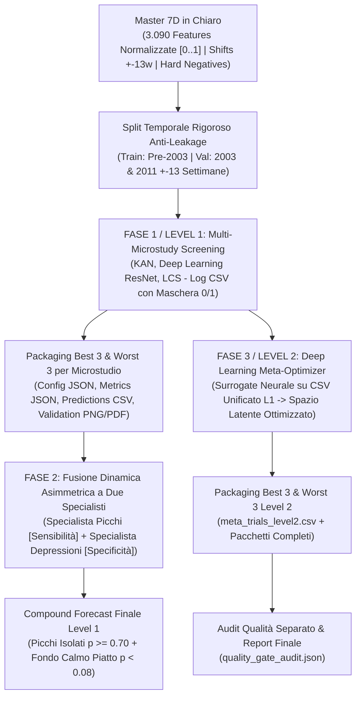

# DLVS-Wave v2.0: Guida Operativa della Pipeline Dual-Mode (Bitwise Compacted & Lean Uncompressed 3-Index)

Questa guida descrive l'architettura, la struttura dati, le modalità di esecuzione e il sistema di checkpoint della **Pipeline Dual-Mode v2.0** per il forecasting dei megathrust ($M \ge 7.7+$) in Giappone.

---

## 1. Architettura e Compromesso di Dimensionalità delle Feature

Per evitare di sovraccaricare il training su CPU con 3.000+ colonne raw, la pipeline supporta due rappresentazioni snelle e ad alto segnale:

1. **Modalità Primaria A (Compattato Bitwise Normalizzato)**:
   - I campi continui astronomici grezzi vengono quantizzati a 2-bit (4 quantili) e impacchettati in interi a 16-bit (`packed_astro_container_*`, 8 campi per container).
   - I container interi e gli shift sismici storici in chiaro vengono successivamente normalizzati su scala $[0.0, 1.0]$.
   - **Se il primo tentativo su compattato bitwise supera i criteri di alta qualità (2/2 picchi hit a $p \ge 0.70$ e sparsità $>90\%$), è sufficiente e viene promosso a vincitore primario.**
2. **Modalità Secondaria B (Lean Uncompressed con solo 3 Index Shift Astro)**:
   - Seleziona i 7 corpi celesti primari (Sole, Luna, Giove, Saturno, Marte, Venere, Mercurio) con le coordinate invarianti (RA, Dec, Distanza, Elevazione).
   - Aggiunge **esattamente 3 shift temporali per i campi astro**:
     1. **Lead +13w** (+3 mesi precursore)
     2. **Lag -13w** (-3 mesi memoria)
     3. **Lead +4w** (+1 mese pre-attivazione)
   - Include tutti gli shift sismici storici pre-evento (`seis_core_magnitude_shift_m7d..m35d`, `depth_shift_...`).
   - Tutte le feature (~45-66 colonne totali) sono rigorosamente normalizzate in $[0.0, 1.0]$.



---

## 2. Come Lanciare la Pipeline (Comandi CLI e Bash)

### Esecuzione Rapida tramite Script Bash:
```bash
./DLVS-Wave-v2/commands/run_uncompressed_pipeline.sh <STUDY_NAME> <L1_TRIALS_PER_MODEL> <L2_TRIALS> <FUSION_MODE>
```

**Esempio:**
```bash
./DLVS-Wave-v2/commands/run_uncompressed_pipeline.sh japan_megathrust_m77_prod 20 20 auto
```

### Esecuzione Diretta con Python:
```bash
.venv/bin/python DLVS-Wave-v2/src/run_uncompressed_l1_l2_pipeline.py \
    --study-name japan_megathrust_m77_prod \
    --l1-trials-per-model 20 \
    --l2-trials 20 \
    --fusion-selection auto \
    --n-best 4 \
    --max-error-threshold 0.45 \
    --shift-weeks 13 \
    --resume
```

---

## 3. Sistema di Checkpoint e Ripresa Automatica (`--resume`)

Il file `study_checkpoint.json` viene aggiornato atomicamente dopo ogni fase:
```json
{
  "study_name": "japan_megathrust_m77_prod",
  "status": "RUNNING",
  "phase": "PHASE_2_COMPLETE",
  "completed_steps": [
    "PHASE_1_MASTER",
    "PHASE_2_LEVEL1"
  ],
  "updated_at": "2026-09-02T15:45:00Z"
}
```
Se il comando viene interrotto, rieseguendolo con il flag `--resume` il sistema salta le fasi già completate e riprende esattamente da dove era rimasto.

---

## 4. Tracciato Record CSV di Monitoring (`trials_all_models.csv`)

Il file CSV unificato di Level 1 e i file locali di ciascun microstudio contengono tutti i campi tracciati:

| Gruppo | Colonna | Tipo | Descrizione |
| :--- | :--- | :--- | :--- |
| **Identificazione** | `trial_id` | `int` | Seriale intero progressivo (1, 2, 3, ...) |
| | `datetime` | `string` | Data e ora di avvio del trial (ISO format) |
| | `elapsed_time_seconds` | `float` | Tempo reale di calcolo del trial |
| | `quality_time_kpi` | `float` | Compromesso qualità/tempo: $\text{Score} / \log(1 + \text{sec})$ |
| | `network_type` | `string` | `kan`, `deep_learning`, `lcs` |
| **Timing** | `train_start_date` | `string` | Data inizio training (es. `1930-01-01`) |
| | `window_before_steps` | `int` | Step pre-evento (es. 3, 5, 7, 13) |
| | `window_after_steps` | `int` | Step post-evento (es. 3, 5, 7, 13) |
| | `background_infill_ratio`| `float` | Percentuale di infill di calma (es. 0.10) |
| **Iperparametri** | `hyper_param1_name/val` | `str/val` | Parametro 1 (es. `grid_size: 3`, `hidden_dim: 64`) |
| | `hyper_param2_name/val` | `str/val` | Parametro 2 (es. `spline_order: 2`, `num_layers: 3`) |
| | `hyper_param3_name/val` | `str/val` | Parametro 3 (es. `learning_rate: 0.005`, `dropout: 0.10`) |
| **Maschera Features** | `num_active_features` | `int` | Conteggio feature attive nel trial |
| | `feat__<nome_campo>` | `int` | `1` se la feature è attiva, `0` se esclusa |
| **Metriche Picchi** | `val_peak_hit_rate` | `float` | 1.0 (2/2 hit a $p \ge 0.70$), 0.5 (1/2), 0.0 |
| | `val_peak_timing_error` | `float` | Offset medio in settimane dai 2 picchi reali |
| | `val_false_negatives` | `int` | Picchi mancati |
| | `train_peak_hit_rate` | `float` | Hit rate storico sul training set |
| **Metriche Calma** | `val_quiescence_sparsity`| `float` | % settimane calme con $p < 0.15$ (Target $\ge 90\%$) |
| | `val_false_positives` | `int` | Falsi allarmi sui periodi di calma |
| | `val_depression_mae` | `float` | Errore medio assoluto sui periodi di calma |
| | `train_quiescence_sparsity`|`float`| Sparsità storica sul training set |
| **Contrasto & Loss** | `val_spike_contrast_ratio`|`float`| Contrasto picco/rumore: $\min(p_{\text{event}}) / (\mu_{\text{calm}} + 2\sigma_{\text{calm}})$ |
| | `val_f1_score` | `float` | F1-Score pesato sui picchi |
| | `train_loss` | `float` | Loss storica di training (**Tie-Breaker**) |
| | `composite_needle_loss`| `float` | Funzione obiettivo composita ottimizzante |

---

## 5. Struttura delle Cartelle di Output

```text
studies_output/<study_name>/
├── 01_data/
│   ├── master_7d_uncompressed_normalized.csv   # Master 100% normalizzato [0..1]
│   └── master_manifest.json
├── 02_level1/
│   ├── trials_all_models.csv                   # CSV unificato globale di Level 1
│   ├── study_kan/
│   │   ├── trials_kan.csv
│   │   ├── best_1/  (trial_config.json, trial_metrics.json, validation_report.png, etc.)
│   │   ├── best_2/
│   │   ├── best_3/
│   │   ├── worst_1/
│   │   ├── worst_2/
│   │   └── worst_3/
│   ├── study_deep_learning/ (trials_deep_learning.csv, best_1..3, worst_1..3)
│   └── study_lcs/           (trials_lcs.csv, best_1..3, worst_1..3)
├── 03_level1_fusion/
│   ├── compound_fusion_manifest.json
│   ├── compound_validation_predictions.csv
│   ├── compound_prospective_forecast.csv
│   ├── compound_validation_report.png (.pdf)
│   └── compound_prospective_forecast.png (.pdf)
├── 04_level2_deep_meta_optimizer/
│   ├── meta_trials_level2.csv
│   ├── l2_meta_manifest.json
│   ├── best_1/  (Pacchetto Best 1 L2)
│   ├── best_2/
│   ├── best_3/
│   ├── worst_1/
│   ├── worst_2/
│   └── worst_3/
├── 05_final_report/
│   └── quality_gate_audit.json                 # Audit separato della qualità
├── study_checkpoint.json                       # File di ripresa stato
└── pipeline_execution.log                      # Log completo di esecuzione
```

---

## 6. Fusione Dinamica Asimmetrica (Specialista Picchi + Specialista Depressioni)

Il modulo di fusione (`fusion.py`) calcola i profili specialistici di ciascun modello selezionato:
- **Specialista Picchi**: Alto hit rate e contrasto, penalizzazione minima sui picchi.
- **Specialista Depressioni**: Alta sparsità di calma, zero falsi allarmi, errore minimo sui periodi di riposo.

Nei momenti in cui il segnale aggregato sale ($p > 0.25$), la fusione conferisce un peso preponderante allo **Specialista Picchi** per non perdere l'evento. Nei periodi di quiete ($p \le 0.25$), conferisce il peso allo **Specialista Depressioni**, azzerando il rumore e impedendo l'insorgere di oscillazioni sinusoidali.
