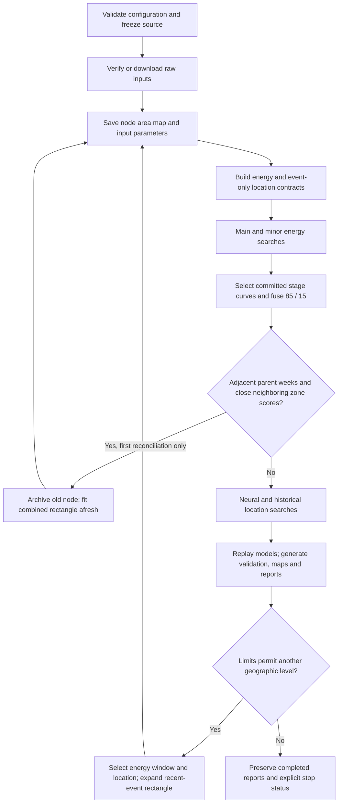

# Forecast pipeline operator guide

Maintained project: **DLVS-Wave-v2**. Entry point: **commands/forecast.sh**.

This guide covers a fresh single-region study and geographic recursion from a
world or regional root. The separate causal Japan energy replay is described
below. The new `origin_refit_astro_only` protocol shares its fitting and sampling
implementation, while excluding all seismic predictors.

## 1. Install and check

From the repository root on Linux, with Python 3.11 or later:

```bash
python3 -m venv .venv
.venv/bin/python -m pip install -r DLVS-Wave-v2/requirements-forecast.txt
bash DLVS-Wave-v2/commands/forecast.sh --help
bash DLVS-Wave-v2/commands/forecast.sh check \
  --config DLVS-Wave-v2/configs/world_nested_production.json
```

The requirements file pins the tested library versions. PyTorch installation may
need the wheel appropriate to your CPU/GPU and platform. The production model
path currently runs on CPU. Use `DLVS_PYTHON=/absolute/path/to/python` to select a
different interpreter. Preflight checks configuration and installed libraries;
it performs **no download and no model fit**. It does not prove that USGS/JPL are
reachable or that an external cache covers the requested dates.

Initial data acquisition uses USGS earthquake data and geocentric JPL Horizons
ephemerides. Internet access is needed unless the requested data are already in
verified caches. Timeouts and incomplete coverage stop the run with evidence.
No placeholder earthquakes or fabricated ephemerides replace missing inputs.

## 2. Run one region, without geographic recursion

```bash
bash DLVS-Wave-v2/commands/forecast.sh run \
  --config DLVS-Wave-v2/configs/region_single_example.json \
  --label japan_region
```

The example rectangle is latitude 28 to 47, longitude 128 to 150. It is a **new
regional World-engine study**, not a reproduction of the completed Japan causal
energy report. Set `initial_geo_level: 0` and `max_geo_level: 0` for one node.
All internal model stages, main/minor energy, both location methods and their
reports still run; only geographic descent is disabled.

To study another area, copy the JSON configuration and change:

```json
{
  "initial_membership_rules": [
    {"type": "rectangle", "bounds": [-25, -5, 165, 190]}
  ],
  "initial_geo_level": 0,
  "max_geo_level": 0
}
```

This fragment belongs inside a complete example configuration. Bounds are
`[south, north, west, east]`. For a date-line crossing use an **unwrapped** interval
such as 165 to 190, rather than 165 to -170. The same membership rule filters
training and validation events and produces the initial area map.

## 3. Run a regional or worldwide nested study

```bash
# Regional L0 through at most L3
bash DLVS-Wave-v2/commands/forecast.sh run \
  --config DLVS-Wave-v2/configs/region_nested_example.json \
  --label regional_nested

# Worldwide L0 through at most L4
bash DLVS-Wave-v2/commands/forecast.sh run \
  --config DLVS-Wave-v2/configs/world_nested_production.json \
  --label world_nested
```

An empty `initial_membership_rules` list means the whole world. The example
forecast dates are deliberately fixed at August 2026 through January 2027;
edit them and `catalog_cutoff` explicitly for a new issue. They never silently
advance with the system clock. `catalog_cutoff` must precede `forecast_start`.

The current coordinator follows **one selected geographic child at each depth**.
It does not explore a tree of several sibling forecasts. Consecutive ambiguous
neighboring zones can instead be combined into one child domain. Do not mistake
the several neural/model branches for parallel geographic branches.



## 4. What the folders mean

Every `run` creates a unique directory; an existing `--output` is refused.

```text
studies_output/
  <UTC timestamp>_<label>_<unique ID>/
    run.sh                          # Resume this study with its frozen source
    run_configuration.json          # Resolved, immutable configuration
    runtime_environment.json        # Python, libraries and thread environment
    source_manifest.json            # Source SHA-256 identities
    source_snapshot/src/            # Python actually used by this study
    shared_raw_inputs/              # Catalog/ephemerides and download receipts
    study_state.json                # Machine-readable node states
    PROGRESS.md                     # Human-readable progress
    level_comparison.csv
    WORLD_NESTED_JOINT_REPORT.pdf    # Combined completed/attempted levels
    L0/n000_world/
      AREA_AND_PARAMETERS.pdf       # Available before model training
      node_configuration.json
      node_state.json
      01_energy_forecast/
        main_bodies_branch/
          01_data/
          02_level1/
          03_level1_fusion/
          04_level2_deep_meta_optimizer/
          05_level3_final_fusion/
        minor_bodies_branch/        # Same five internal stages
        fusion_main_minor/          # Weighted curves, selection proof, reports
        ENERGY_FORECAST_MASTER_REPORT.pdf
      02_location_forecast/
        01_data/                    # Events and fitted zone metadata
        extended_search/            # Actual model trials/checkpoints
        dual_method_reports/
          learned/                  # KAN / Deep ResNet / LCS
          historical_analogs/       # Weighted historical analog matching
          fused_methods/            # Neural/historical score combination
        SPATIAL_ZONES_MASTER_REPORT.pdf
      JOINT_ENERGY_AND_SPACE_SUPER_CONSOLIDATED_REPORT.pdf
      study_status.pdf              # Added automatically when a node stops
      ZONE_UNION_LINEAGE.pdf         # Present after a zone reconciliation
    L1/n001_selected_region/         # Same node structure
    L2/n002_selected_region/
    test/                           # Superseded own-node attempts only
```

The internal `02_level1` through `05_level3_final_fusion` folders are **model
stages**, not geographic L1/L2/L3. Folder labels such as `learned` and
`historical_analogs` are the actual World layout; the separate Japan publication
adapter also exposes `a/`, `b/` and `fusion_a_b/` views. File presence alone is
not a completed forecast: check `study_state.json` and the node status page.

## 5. Selection rules and special cases

| Setting / case | Behavior |
|---|---|
| `main_fusion_weight: 0.85` | Every final Y value is `0.85 * main + 0.15 * minor`, for validation and forecast. No second sigmoid/minimum is applied to this sum. |
| Default stage selection | Rank each saved energy stage by validation event hits, false positives and calibration loss. Raw model trials have already undergone specialist fusion. |
| `huntanyway: true` | If a branch's validation-selected stage has no distinct forecast peak, recover a saved earlier stage with a peak. Prefer a stage near the parent window, then validation rank. Reuse its real curves; do not invent a peak. |
| Branches disagree | The final curve keeps fixed 85/15 weights. There is **no separate calibrated-confidence voting algorithm**. Parent proximity participates in recovery, not all ordinary stage selections. |
| `energy_fusion_policy.parent_tolerance_weeks: 1` | Recovery checks overlap with the parent interval expanded by one week. Evidence is saved in `weighted_fusion_selection.json`. |
| `selection_mode: first_event` | Select the earliest interior local maximum after `selection_start`, irrespective of amplitude. A completely flat curve has no event. |
| `first_peak` / `largest_peak` | Apply the configured absolute threshold and prominence, then choose the first/largest accepted peak. |
| `largest_observed_peak` | Legacy mode selects the highest ordinate, including on a flat curve. Prefer `first_event` when a distinct peak is required. |
| `follow_peak_without_quality_gate: true` | Allow geographic routing despite the quality/score-margin gates. This does not create validation data, extend budgets, or convert a score into earthquake magnitude. |
| Temporal zoom | Child forecast spans `child_weeks_before` before the parent apex through `child_weeks_after` after it, including the final week. Defaults: 2 and 2. |
| Recent-event rectangle | Use events available at cutoff, recent 10 years, recency half-life 5 years, central 98% coordinate coverage and 200 km margin. Longitude is unwrapped. Insufficient high-magnitude support falls back to the configured downloaded catalog. |
| Consecutive weeks / neighboring zones | Default gap at most 7 days, shared spherical Voronoi boundary, score difference at most 0.05 at both dates. Union the zones, derive a recent-event rectangle, and fit both energy and location afresh. At most one reconciliation per node. |
| Constant or absent curves | Preserve evidence and stop when the selected mode requires a peak. `huntanyway` cannot recover information absent from every saved curve. |
| Missing recent energy events | Reduce the target in `magnitude_step` increments, within `maximum_energy_target_reduction`; protect training retention and event recency. Stop with the attempts recorded if still insufficient. |

For example, parent November 2 / zone 4 and child October 26 / adjacent zone 2
can trigger one combined domain. A November 2 versus December 7 discrepancy does
not satisfy the default consecutive-week rule. Close scores alone do not suffice
if the zones are not adjacent. The final lineage page explains the actual trigger.

## 6. Validation and forecast protocols: important differences

Validation selects features, models, stages and calibration. It is intentionally
**not an untouched test set**. Scores/zone margins are not calibrated physical
earthquake probabilities. Known future astronomy is allowed; unknown future
earthquake observations must not be input features.

| Contract | Legacy World (`legacy_astro`, default when absent) | New World (`origin_refit_astro_only`) | Japan energy refresh |
|---|---|---|---|
| Energy inputs | Astronomy | Astronomy only; no past or future seismic indices | Astronomy + cutoff-safe past seismic fields |
| Historical validation | One fit before first corridor | Separate prior-only fit for each corridor | Separate prior-only fit for each corridor |
| Forecast fit | Reuses validation fit | New fit through catalog cutoff | New fit through forecast issue |
| Infill | Trial seed | Pi-derived per-gap seeds in both branches | Pi-derived per-gap seeds in both branches |
| Terminal calm | Not guaranteed retained | All observed terminal rows; partial week disclosed | All observed terminal rows; partial week disclosed |
| LCS input | Continuous normalized fields | Astronomy-only bitfields; separate training-only codebook per origin | Bitfields + cutoff-safe seismic fields |
| Location | Event-only neural + historical | Same methods, newly fitted; optional compact window and event cap | Previous location fits explicitly reused during energy-only refresh |

Choose the new protocol using `configs/world_nested_astro_refit.json`. Existing
JSON configurations without `energy_protocol` retain the legacy numerical path.
Existing study snapshots are not migrated. Changing the protocol requires fresh
trials; raw verified catalog/ephemeris caches are reusable. Forecast scores can
change, but protocol differences alone do not establish why an old run failed.

A child zoom can start months after the common catalog cutoff. It still refits
only through that cutoff: the gap before the zoom is **not** labelled calm.
Future astronomical positions are available as predictors; future earthquake
observations never enter training. Validation still selects parameters and
fusion, so its reported accuracy is not an independent generalization estimate.

The new location example permits at most **30 earthquakes**, aims for a shorter
whole-week suffix covering every zone, and retains at least **12 earthquakes**.
Both limits are options. The actual training/validation split moves, and zones
are refitted using only the resulting training history. No chart-only truncation
or within-week split hides events. If a compact candidate loses geographic
support, the last supported split is retained within the hard event cap; reasons
are recorded in `event_only_master_manifest.json` under `window_adjustments`.
Failure to satisfy minimum support and the cap stops the node explicitly.

## 7. Budgets, stops and unattended execution

Limits exist at whole-study, node, branch and trial-count levels. A branch can
finish fewer trials than its cap when time expires; report committed counts.
Node and study elapsed time are recorded, with new-run node budgets charging
active execution rather than pause duration. A single fit/calibration/report is
not preempted at every instruction; the coordinator bounds workers and preserves
completed checkpoints. Operating-system termination during a write can still
require recovery. Keep the process attached to a managed terminal/service if
the launching terminal may close.

```bash
# Verify/download inputs first, without fitting
bash DLVS-Wave-v2/commands/forecast.sh run \
  --config DLVS-Wave-v2/configs/world_nested_production.json \
  --output DLVS-Wave-v2/studies_output/my_world_study --inputs-only

# Continue with the SAME source and saved configuration
bash DLVS-Wave-v2/commands/forecast.sh resume \
  --study DLVS-Wave-v2/studies_output/my_world_study

# Read progress without launching anything
bash DLVS-Wave-v2/commands/forecast.sh status \
  --study DLVS-Wave-v2/studies_output/my_world_study
```

Each study also has its own `run.sh`. It retains the original interpreter path;
override `DLVS_PYTHON` after moving to another machine. Model/CSV manifests can
contain absolute artifact paths: relocation is **not** an automatic migration.
Keep the directory location stable for exact resume, or create a new study with
raw inputs. Do not edit manifests just to bypass source/data mismatch checks.

Exit 0 means normal bounded completion or `--inputs-only` completion; inspect
state to distinguish them. Exit 75 means an interrupted/stopped execution such
as insufficient data. Exit 2 indicates a launcher/configuration problem. A data
stop will repeat until its cause changes; do not loop blindly on `resume`.

Wall-time-limited trial counts may differ on different hardware. Repeating the
same seed alone cannot guarantee the same selected ensemble. The study stores
source, input hashes, actual trial records and runtime versions; strict selected
model replay verifies cached numerical predictions. The World location replay
can try a bounded list of BLAS thread counts while keeping the same tolerance.
USGS catalogs can be revised after an event; an occurrence cutoff is not proof
of an archived historical publication-time snapshot.

## 8. Reproduce the separate Japan causal energy calculation

Use `commands/run_causal_japan_energy.sh --help` and a local copy of
`configs/japan_causal_energy.json`. Provide the real local earthquake CSVs,
astronomical masters and `location_reference_root`. Those inputs and trained
location models are deliberately **not in GitHub**. The existing completed Japan
study is not regenerated by any example in this guide.

```bash
bash DLVS-Wave-v2/commands/run_causal_japan_energy.sh \
  --config /absolute/path/to/local-japan-config.json \
  --output /absolute/path/to/new-japan-study \
  --infill-seed-mode pi_pairs --pi-pair-offset 0
```

That adapter preserves the specific report renderer from its reference snapshot.
A missing reference is an error, not permission to substitute World charts.
The maintained source now also contains `energy_report_spectrum.py`, which was
previously present only in the completed study snapshot.

## 9. Tests and publication

```bash
OPENBLAS_NUM_THREADS=1 OMP_NUM_THREADS=1 \
  .venv/bin/python -m unittest discover -s DLVS-Wave-v2/tests -v
```

The offline tests use temporary synthetic fixtures to check contracts, weighted
fusion, first-event selection, date-line handling, zone reconciliation, raw-input
resume, source tampering detection and stopped-node PDF generation. They do not
claim predictive accuracy or replace a full production run. Review rendered
production PDFs before distribution; page navigation and status pages are
generated by Python, not patched manually after publication.

Commit maintained Python, shell launchers, example configurations, requirements,
tests **source** and this documentation. Do not commit `studies_output`, PDFs,
trial arrays, fitted models, caches, logs or test-generated artifacts. See
`FORECAST_RULES_AUDIT.md` for the requirement-by-requirement implementation audit.

## 10. New World protocol: configurable options and examples

```bash
# Read-only check, then an unattended fresh World run:
bash DLVS-Wave-v2/commands/forecast.sh check --config DLVS-Wave-v2/configs/world_nested_astro_refit.json
bash DLVS-Wave-v2/commands/run_world_astro_refit.sh --output /absolute/new/world_study
# Or prepare source/configuration/run.sh without downloading or fitting:
bash DLVS-Wave-v2/commands/run_world_astro_refit.sh --output /absolute/new/world_study --initialize-only
# Then launch from its own frozen source:
bash /absolute/new/world_study/run.sh
```

Use **one** of the fresh-run examples for a destination; an existing directory is
refused. To run a single region, copy the new JSON, set `initial_membership_rules`
to a rectangle and set `max_geo_level: 0`. For regional recursion use the same
rectangle and `max_geo_level: 4`. All branches, refits and reports use the same
Python path in both modes; there is no manually assembled regional workflow.

| Option | New example | Effect |
|---|---|---|
| `energy_protocol` | `origin_refit_astro_only` | Shared Japan fitting/sampling, astronomy-only masters |
| `infill_seed_mode` | `pi_pairs` | Per-gap pi seeds; `trial_seed` is an optional ablation |
| `pi_pair_offset` | 0 | Starting offset into the pi-pair seed sequence |
| `terminal_infill` | `all_observed` | Retain every observed terminal row; other policies rejected |
| `bitwise_energy` | true | Required by this protocol for LCS; legacy continuous input is a separate protocol |
| `astronomy_offset_weeks` | -26,-13,-8,-4,4,8,13,26 | Searchable lags/leads for every astronomical field |
| `astronomy_horizon_padding_weeks` | 12 | Additional ephemeris coverage for nested zooms; no extra seismic observations |
| `catalog_cutoff` | 2026-07-31 23:59:59 UTC | Last observable earthquake instant for refit |
| `energy_validation_events` | 2 | Two or three event weeks, with actual earthquake count disclosed |
| `maximum_energy_target_reduction` | 0.5 | Maximum magnitude relaxation for recent supported energy validation |
| `max_energy_validation_age_years` | 5 | Recent energy validation search constraint |
| `max_training_event_removal_fraction` | 0.25 | Protect historical training support |
| `location_validation_days` | 730 | Initial upper time window before compacting |
| `minimum_location_validation_events` | 12 | Minimum actual earthquake count |
| `maximum_location_validation_events` | 30 | Hard actual earthquake cap, including same-week events |
| `minimum_zone_validation_events` | 1 | Minimum coverage in every fitted zone |
| `compact_location_validation` | true | Seek shortest supported whole-week validation suffix |
| `location_window_refinement_max_steps` | 3 | Bound repeated zone refits during compaction |
| `main_fusion_weight` | 0.85 | Pointwise main weight; minor gets 0.15 |
| `huntanyway` | true | Recover existing stage peaks; never invent peaks |
| `selection_mode` | `first_event` | Select first eligible local maximum, without amplitude gate |
| `child_weeks_before`, `child_weeks_after` | 2,2 | Temporal zoom around parent event |
| `child_rectangle_recent_years` | 10 | Recent observed events supporting the next rectangle |
| `child_rectangle_buffer_km` | 200 | Geographic margin around that rectangle |
| `zone_reconciliation_enabled` | true | Automatic neighbouring-zone union for consecutive windows |
| `zone_reconciliation_max_gap_days` | 7 | Maximum temporal separation for union |
| `zone_reconciliation_max_score_gap` | 0.05 | Parent-zone score ambiguity needed for union |
| `maximum_study_seconds`, `maximum_node_seconds` | 28800,7200 | Study and node active-time budgets |
| `energy_branch_max_seconds` | 3600 | Energy search budget for each main/minor branch |
| `branches.*.trials_per_family`, `refinement_trials` | See JSON | Independent search caps; time limit can stop sooner |
| `minimum_disk_free_mb` | 500 | Reserve space for selected models and final reports |

No seismic-feature switch enables contaminated indices in this protocol.
Energy labels and geographic coordinates remain necessary targets and scope
information, but they are not energy predictor features.

### Source upgrades and Git publication

Edit maintained Python in `DLVS-Wave-v2/src`, then run:

```bash
python3 DLVS-Wave-v2/src/forecast_source_manifest.py --write
python3 DLVS-Wave-v2/src/forecast_source_manifest.py --check
.venv/bin/python -m unittest discover -s DLVS-Wave-v2/tests -v
```

The new protocol freezes exactly the dependency files listed in
`docs/FORECAST_SOURCE_MANIFEST.json`; a stale manifest prevents launch. Each study
keeps `source_snapshot/src`, `source_manifest.json`, configuration and runtime
versions. Commit the maintained source, manifests, examples, tests and guides.
Exclude study outputs, trial records, models, caches, PDFs and test artifacts.
The study copy records **what ran**; the project and GitHub hold the maintained
implementation for future runs. A changed source upgrade starts a new study;
resume always verifies and uses the old immutable snapshot.

## 11. Independent training and validation magnitudes

All four thresholds are read by Python data builders, not manually applied to
reports. Set them in JSON or override them on `forecast.sh check` / `run` using
these command-line arguments. Underscore JSON keys correspond to hyphenated CLI
arguments; command-line values take precedence and are saved in the new study's
`run_configuration.json`. Nested nodes and both main/minor workers inherit them.

| Purpose | JSON key | Python / Bash argument |
|---|---|---|
| Energy training and forecast refit | `energy_training_magnitude` | `--energy-training-magnitude` |
| Energy validation, requested threshold | `energy_validation_magnitude` | `--energy-validation-magnitude` |
| Energy validation, lowest allowed threshold | `energy_validation_min_magnitude` | `--energy-validation-min-magnitude` |
| Location training | `location_training_magnitude` | `--location-training-magnitude` |
| Location validation, requested threshold | `location_validation_magnitude` | `--location-validation-magnitude` |
| Location validation, lowest allowed threshold | `location_validation_min_magnitude` | `--location-validation-min-magnitude` |
| Raw catalog download | `download_floor` | `--download-floor` |

For example, keep energy at M7.7 in both training and validation, use M6.8 for
location training, and allow only location validation to relax as far as M6.3:

```bash
bash DLVS-Wave-v2/commands/run_world_astro_refit.sh \
  --energy-training-magnitude 7.7 \
  --energy-validation-magnitude 7.7 \
  --energy-validation-min-magnitude 7.7 \
  --location-training-magnitude 6.8 \
  --location-validation-magnitude 6.8 \
  --location-validation-min-magnitude 6.3
```

The same arguments work directly with `python src/forecast_cli.py run --config
...`. Use `check` instead of `run` for a read-only preflight. To fix location
validation at exactly M6.3, set both its requested and minimum values to 6.3.
If support is insufficient at a fixed threshold, the node stops with its reason;
it does not lower the threshold behind the operator's back.

An explicit energy training threshold remains fixed if the validation threshold
is relaxed. Forecast refit uses that training threshold. If training and
validation thresholds differ, the report records both: validation then assesses
a different event cutoff, not an identical target population. The energy data
contract records `thresholds_differ`, `training_magnitude`,
`forecast_refit_magnitude` and effective validation magnitude. Training figures
filter actual events by the training threshold, not the validation threshold.

Backward compatibility: without the new energy training option, legacy energy
training continues to follow the effective energy validation threshold.
`energy_magnitude` remains the fallback requested energy validation threshold.
`location_magnitude` remains the fallback location training threshold; location
validation starts there unless separately configured. Without an explicit
energy validation minimum, `maximum_energy_target_reduction` sets its range,
bounded by the download floor. Location validation otherwise uses the download
floor. Explicit validation minimum options take precedence over those defaults.
No threshold may fall below downloaded catalog coverage.

Resume deliberately does not accept threshold overrides: changed thresholds
require new data labels and fresh fits in a separate study. A running frozen
study is unaffected by upgrades to maintained source or documentation.

## 12. Compact bitwise search and safe sequential execution

The compact policy retains LCS bit packing while reducing the number of inputs
searched together. It is available for both Japan and World, with fresh studies
so that earlier fitted results and their reports remain intact.

| Setting | Compact policy |
|---|---|
| KAN / Deep feature counts | 4, 8, 12, or 16 per trial |
| LCS feature counts | 2, 4, 6, or 8 inputs per trial; packed containers remain packed |
| Shifted base astronomical fields | First 12, in declared source order |
| Astronomical offsets | -13, +4, +13 weeks |
| Initial trial target | 500 per family, 1,500 per branch |
| Refinement cap | 300 per branch; same feature-width limits |
| Branch time ceiling | 10,800 seconds including reserved final work |
| Parallel model workers | 1 |
| Memory admission reserve | 4,096 MiB available before starting a worker |
| Linux service memory | 2,500 MiB high / 3 GiB maximum / 512 MiB swap |

Trial caps are targets, not a promise: time or storage limits can stop a search
earlier. Search state records the actual count and stop reason. No successful
validation is inferred from the requested count. The smaller feature universe
and prior-only contexts change the fitting problem; old fitted trials cannot be
silently presented as new compact-policy trials. A packed container encodes up
to eight two-bit fields; selecting eight containers is not selecting only eight
raw astronomical quantities. Japan retains its declared causal seismic lags;
World retains its strict absence of seismic predictors.

Use `configs/world_nested_compact_bitwise.json` for World. For Japan, pass `--policy configs/japan_compact_bitwise_policy.json` to
`run_causal_japan_energy.py --config EXISTING_CONFIG --output NEW_STUDY`.
The launcher merges and freezes the full configuration before initialization.
The policy deliberately does not contain machine-specific input paths.
The optional keys are `energy_feature_counts` (per-family lists),
`astronomy_shift_max_base_fields`, `compact_astronomy` (Japan),
`max_parallel_workers`, and `minimum_available_memory_mb`. Historical policies
without feature limits keep their original candidate-width search behavior.

Initialize each study with its existing CLI and `--initialize-only`. Then run:

```bash
bash commands/run_compact_forecast_pair.sh /absolute/JAPAN_STUDY /absolute/WORLD_STUDY
```

This launcher requires a Linux user systemd session and starts Japan, then World,
in one resource-limited service. It never starts the second study after a failure
of the first. The service has a 32-hour total ceiling; individual study/node and
branch ceilings also apply. Inspect `systemctl --user status
 dlvs-compact-forecast-pair` and each study's saved progress. If a cap is reached,
keep the checkpoints and investigate before resuming. The worker admission check
is not a hard memory cap; the service cgroup supplies the hard cap.

## 13. Report editions without a cover map

The maintained executive-cover renderer omits the location map by default.
Its optional Python argument `show_location_map=True` permits an explicit legacy
layout. Method-specific maps remain in Location Forecast. Every relevant page
now explains whether it uses neural models, historical analogs, or their
supplementary score fusion. These are distinct methods; agreement on a
retrospective example must be checked against dated observations and the saved
pre-event forecast, rather than inferred from a region name.

To update reports from saved Japan trial outputs:

```bash
bash commands/reissue_forecast_report.sh --study /absolute/EXISTING_JAPAN_STUDY
```

The joint, energy and location PDFs are published directly in the study root.
Energy/location copies also appear in their corresponding study subfolders.
Previous PDFs and their navigation metadata are archived under
`report_editions/previous_<timestamp>_<id>/` before replacement, with verified
hashes. Trial data, model files, source graph pages and active study directories
are not moved. The optional `--output` selects an internal edition workspace;
it never changes the public destination of the reports.

The script replays saved energy fusion arrays, checks agreement with saved
curves, reuses the established graph pages, and rebuilds the contents and method
explanations. The study publication manifest points to the root PDFs and records
the internal edition and prior archive. `REPORTS.md` gives the reader the entry
point. This is report republication, not new model training. Inspect rendered
pages before marking an edition visually reviewed. Reports and trial artifacts
remain excluded from source commits.
